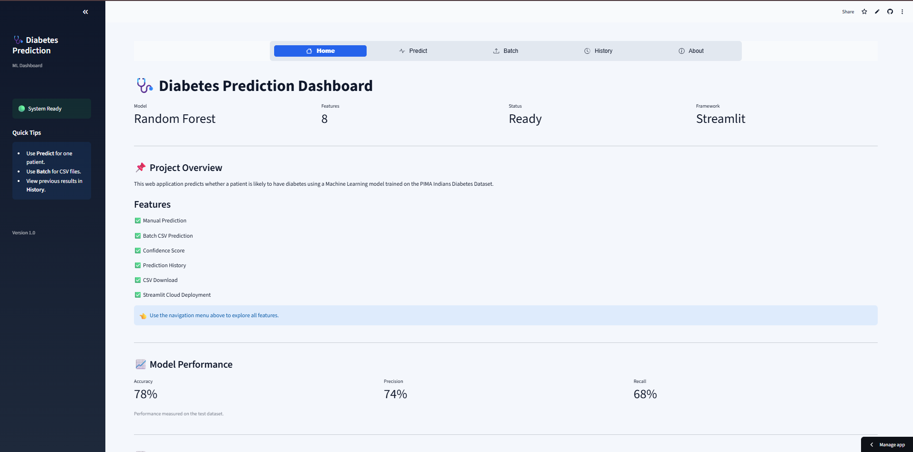
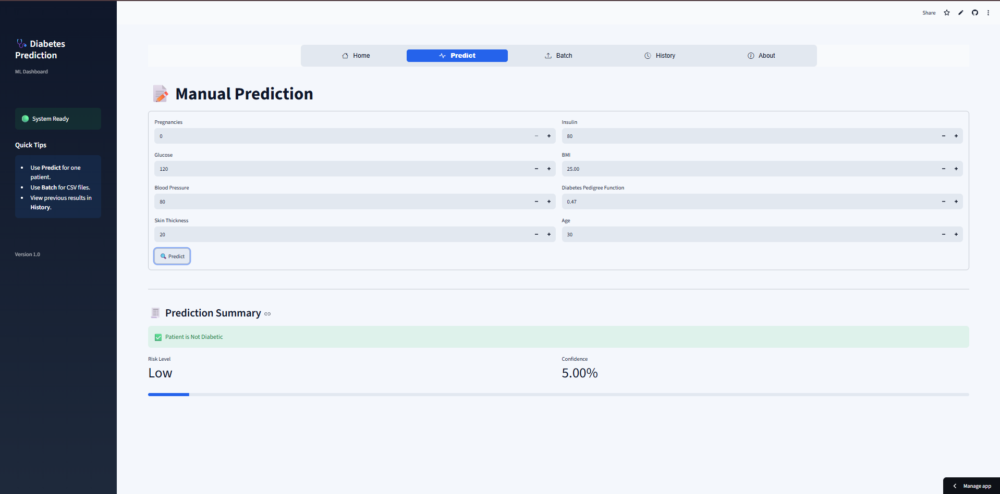
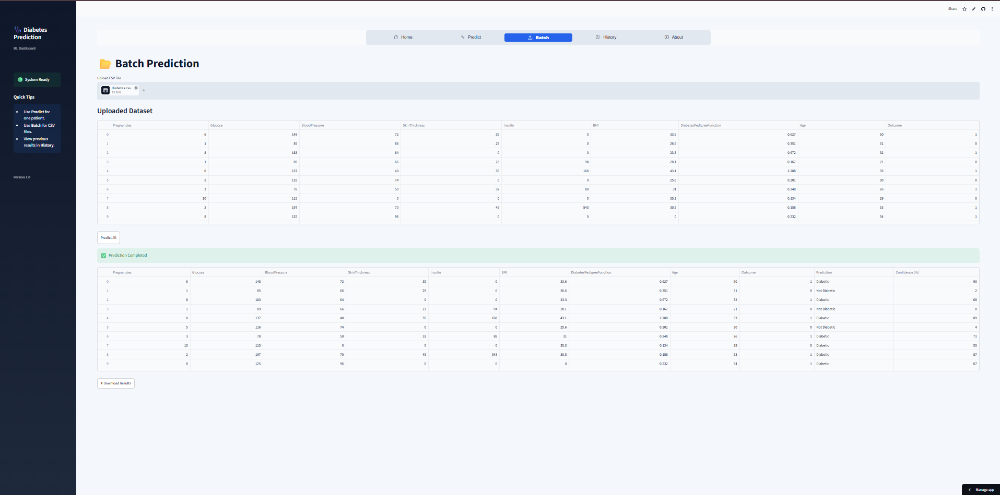
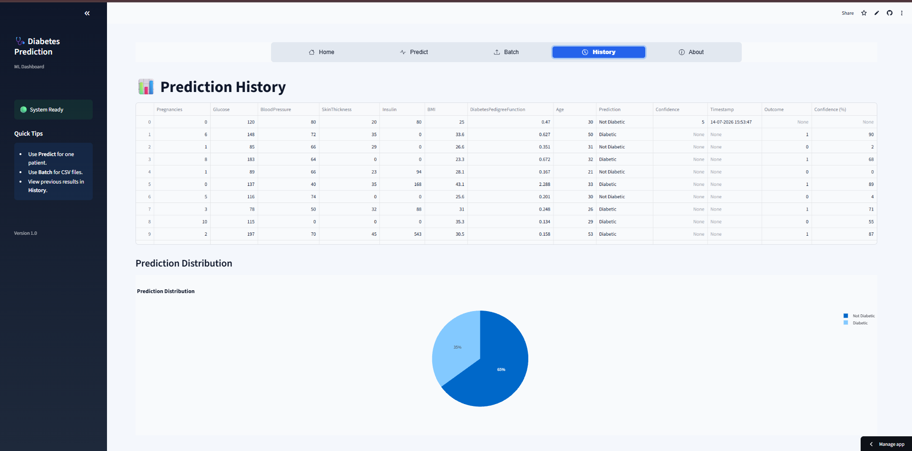
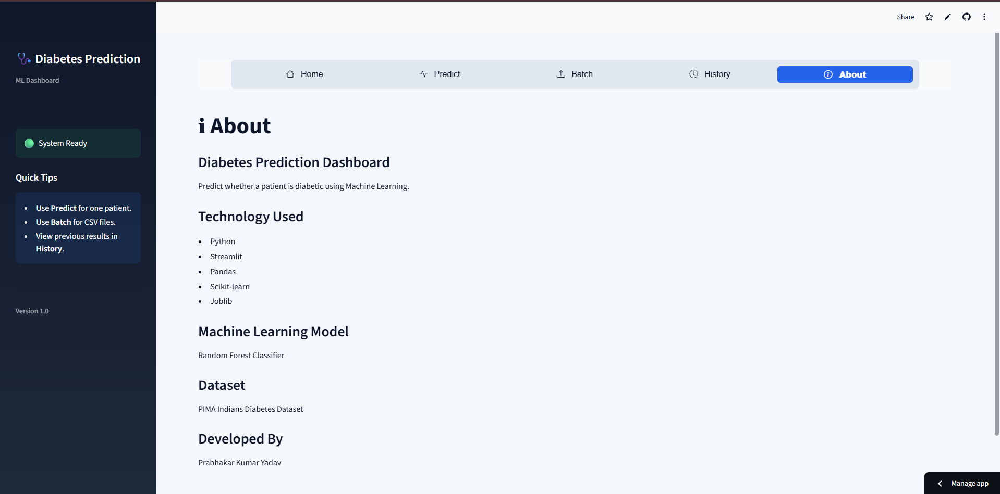

# 🩺 Diabetes Prediction Dashboard


A Machine Learning web application that predicts whether a patient is likely to have diabetes using a **Random Forest Classifier** trained on the **PIMA Indians Diabetes Dataset**.

---

## 🚀 Live Demo

👉 **https://diabetes-prediction-ml-f5fqlhelzbycwvj4xuj4z3.streamlit.app/**

---

# ✨ Features

- 📝 Manual Diabetes Prediction
- 📂 Batch CSV Prediction
- 📈 Feature Importance Analysis
- 📊 Prediction History
- 🥧 Interactive Charts
- 📥 CSV Download
- ☁️ Streamlit Cloud Deployment

---

# 🛠️ Tech Stack

- Python
- Streamlit
- Scikit-learn
- Pandas
- Plotly
- Joblib

---

# 🤖 Machine Learning Model

| Property | Value |
|----------|-------|
| Model | Random Forest |
| Dataset | PIMA Indians Diabetes Dataset |
| Features | 8 |
| Accuracy | 78% |

---

# 📷 Screenshots

## 🏠 Home



---

## 📝 Manual Prediction



---

## 📂 Batch Prediction



---

## 📊 Prediction History



---

## ℹ️ About



---

# 📁 Project Structure

```text
Diabetes-Prediction-ML
│
├── app.py
├── utils.py
├── config.py
├── requirements.txt
├── README.md
│
├── assets
│   ├── style.css
│   └── screenshots
│
├── model
│   └── best_diabetes_model.pkl
│
└── data
```

# ⚙️ Installation

```bash
git clone https://github.com/yourusername/Diabetes-Prediction-ML.git

cd Diabetes-Prediction-ML

pip install -r requirements.txt

streamlit run app.py
```

---

# 👨‍💻 Developer

**Prabhakar Kumar Yadav**

- GitHub: https://github.com/prabhakarkumaryadav40-glitch
- LinkedIn: www.linkedin.com/in/prabhakar-kumar-yadav-675379359

---

⭐ If you found this project useful, consider giving it a star!